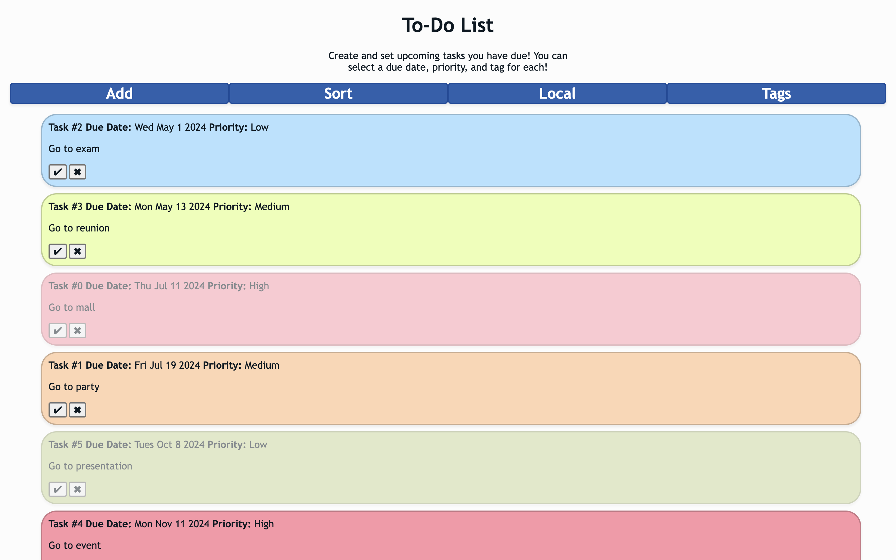

# To Do List
 - Consists of Javascript, jQuery CSS, & HTML

This task manager site allows a user to add any tasks that they must complete, including information such as the description, due date, priority, and tag. For tags, users can dynamically add tags if the preset 'Personal' and 'Work' tags do not apply to the tasks they want to add. Users have the option sort the tasks by ID, due date, priority, and tag as well. Users can also save and load their tasks from local storage. 

